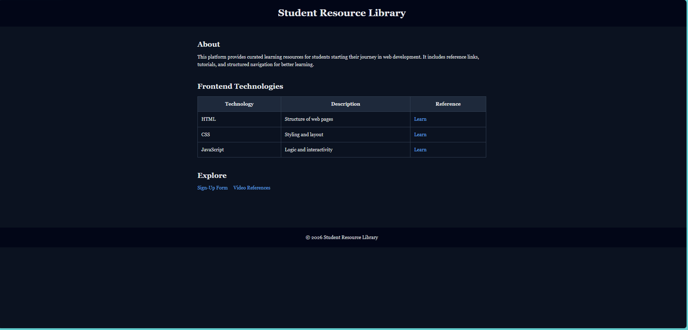
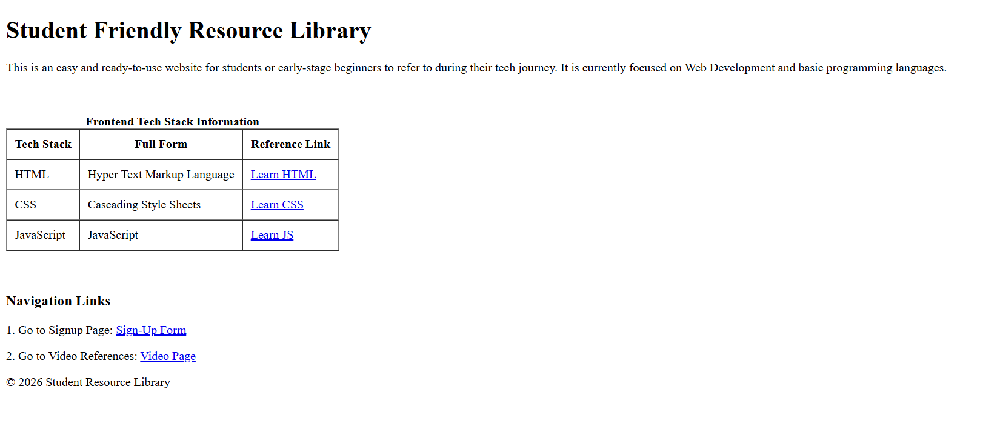

# Resource Sharing Library (HTML + CSS)

🔗 **Live Site:**  
https://tusharr-mishra.github.io/resource-library-html/

---

  

## About The Project

This project is a structured **resource sharing library website** built using HTML and later enhanced with CSS.  
It is designed to organize and provide easy access to useful learning resources in a clean and navigable format.

The project was initially created using only HTML and later improved using CSS to enhance layout, spacing, and overall readability.

---

## Tech Stack

---

## Features

- Multi-page structured layout  
- Organized resource sections  
- Navigation across pages  
- Improved layout using CSS  
- Clean and readable design  

---

## Screenshots

### Before (HTML Only)

  

### After (HTML + CSS)

  

---

## What I Learned

- Structuring multi-page websites using HTML  
- Organizing content for better usability  
- Styling layouts using CSS  
- Managing spacing, alignment, and readability  
- Handling assets (images, videos) in projects  

---

## Future Improvements

- Improve responsiveness for mobile devices  
- Add search and filtering functionality  
- Enhance UI consistency  

---

## Project Structure

resource-library-html/  
├── index.html  
├── signup.html  
├── videos.html  
├── css/style.css  
└── assets/images/  

---

## Author

**Tushar Mishra**

---

⭐ If you like this project, consider giving it a star!
