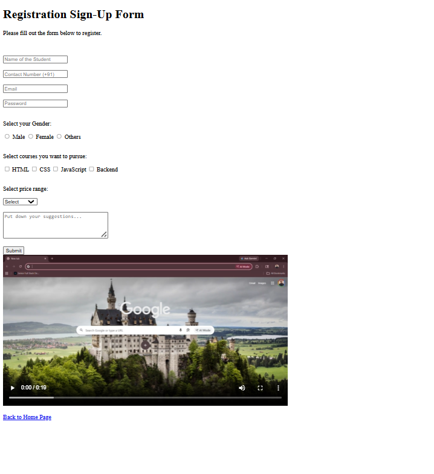
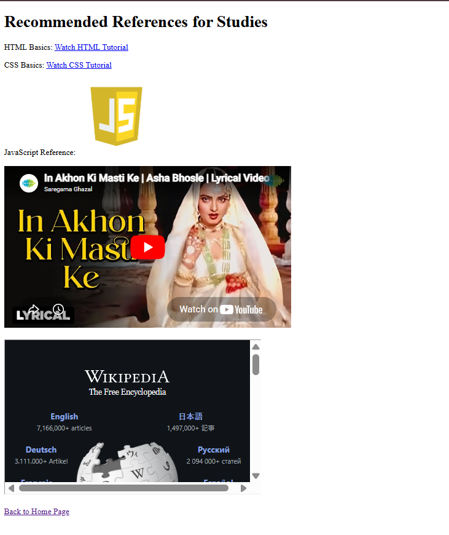

# Resource Sharing Library (HTML)

🔗 **Live Site:**  
https://tusharr-mishra.github.io/resource-library-html/

---

## About The Project

This project is a simple and structured **resource sharing library** built using pure HTML.  
It is designed to organize and provide easy access to useful learning resources in a clean and navigable format.

The project demonstrates fundamental web development concepts and will be enhanced with CSS styling, better UI, and additional features in future updates.

---

## Tech Stack

---

## Features

- Organized resource sections  
- Easy navigation between pages  
- Clean and simple layout  
- Beginner-friendly structure  

---

## Screenshots

### Home Page

### Categories / Resources

### Library View

---

## Future Improvements

- Add CSS styling  
- Add search and filter functionality  
- Make the website responsive  
- Improve UI/UX design  

---

## Project Structure

resource-library-html/
├── index.html
├── (other html files)
└── screenshots/

---

## 🙌 Author

**Tushar Mishra**

---

⭐ If you like this project, consider giving it a star!
